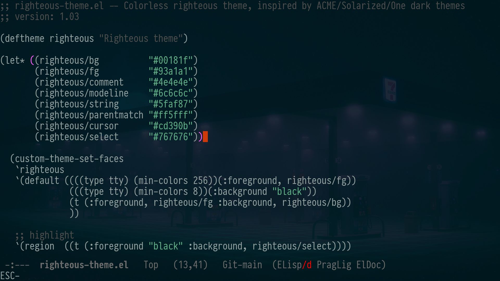
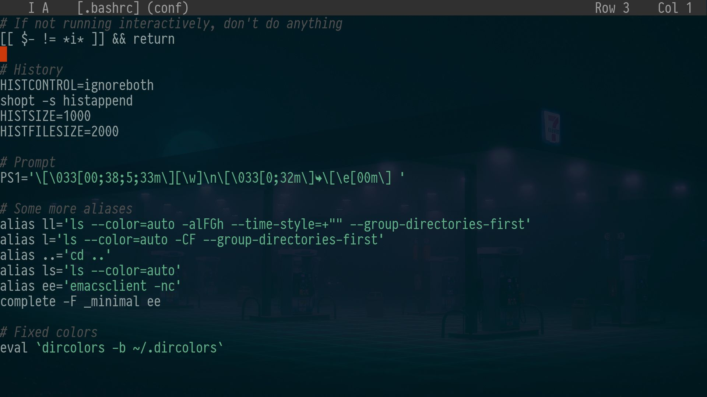

## Righteous
A righteous dark theme for Emacs, inspired by Acme/Solarized themes.

### Emacs


## Installing

Copy `righteous-theme.el` to the `~/.config/emacs/themes` and add to the `init.el`:

```elisp
(add-to-list 'custom-theme-load-path (expand-file-name "~/.config/emacs/themes")
(load-theme 'righteous t)
```


If Emacs 29 version or high, theme looks the best with transparent background.
Wayland WMs have compositor out the box (best experience with [DWL](https://codeberg.org/dwl/dwl)), for X11 need `picom` or alternatives.
Transparent is enabled by adding: 

```elisp
(add-to-list 'default-frame-alist '(alpha-background . 88)) ;where '88' is opacity
```

## Added minimal theme for Joe (jmacs) editor

copy `righteous.jcf` to the `~/.joe/colors/` and add to the `.jmacrc`:

```bash
-colors righteous
```

### Joe (jmacs)


Enjoy ;)
