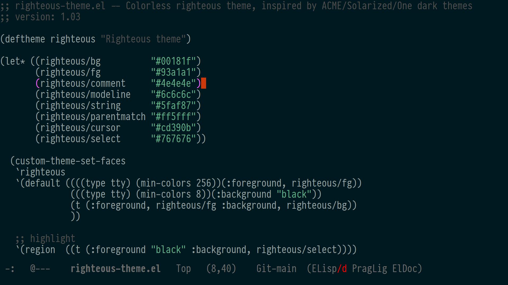

## Righteous
A righteous dark theme for Emacs, inspired by Acme/Solarized themes.



## Installing

copy `righteous-theme.el` to the `~/.config/emacs/themes` and put the following in your Emacs `init.el`:

```elisp
(add-to-list 'custom-theme-load-path (expand-file-name "~/.config/emacs/themes")
(load-theme 'righteous t)
```

## Added minimal theme for Joe (jmacs) editor

copy `righteous.jcf` to `~/.joe/colors/` and add to the `.jmacrc`

```ini
-colors righteous
```

Enjoy ;)
