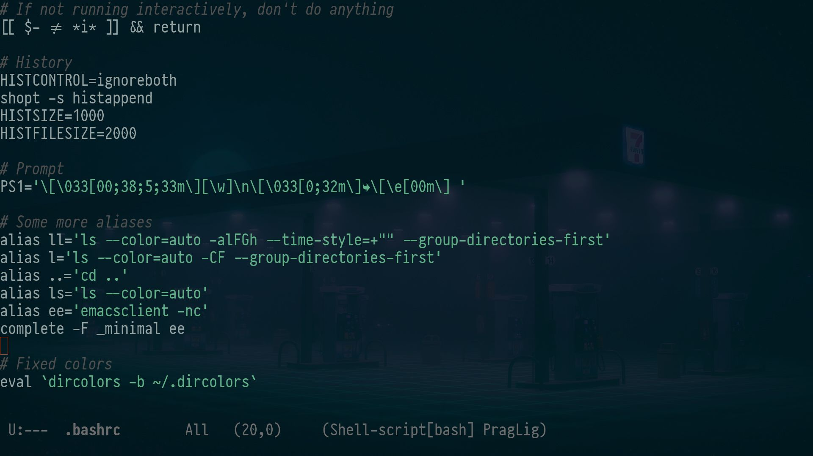

## Righteous
A righteous dark theme for Emacs and other editors, inspired by the Acme/Solarized themes.

### Emacs


## Installing

Copy `righteous-theme.el` to the `~/.config/emacs/themes` and add in `init.el`:

```elisp
(add-to-list 'custom-theme-load-path "~/.config/emacs/themes")
(load-theme 'righteous t)
```

