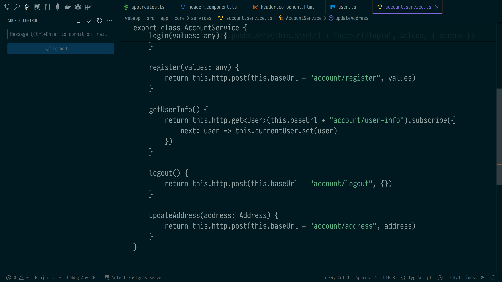

<h2 align="center">Righteous theme</h3>
<hr/>

A "Righteous" dark theme for VSCode, Emacs and other editors, inspired by the Acme/Solarized themes.

### VSCode Screenshot


### Installing
Launch VS Code Quick Open (Ctrl+P), paste the following command, and press enter.

```bash
ext install neuromagus.righteous-theme
```

Other editors in named folders

Enjoy ;)
